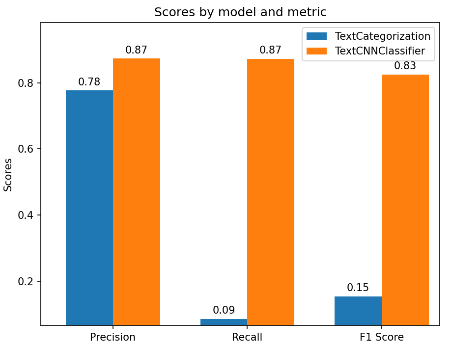
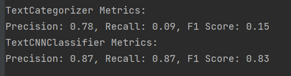

# Cyberbullying Detection Project

## Overview 📖

The Cyberbullying Detection Project is dedicated to creating a powerful text classification system to identify and address cyberbullying instances in digital communication in Polish language. Employing advanced machine learning models, this project categorizes text data into cyberbullying or non-cyberbullying categories, helping to foster safer online interactions.
## Dataset 📊

The project leverages a comprehensive dataset comprising various text samples, meticulously labeled as either cyberbullying or non-cyberbullying content. This dataset is instrumental for training the models to accurately discern between harmful and non-harmful online interactions.

## Installation 💻

To set up this project, ensure you have Python, TensorFlow, and SpaCy installed.

- **Python**: Ensure Python is installed. [Download Python](https://www.python.org/downloads/).
- **TensorFlow**: Install TensorFlow for Python using pip:

```
pip install tensorflow
```
 - **SpaCy**: Install SpaCy and download the polish language model:
```
pip install spacy
python -m spacy download pl_core_news_sm
```
## Usage 🛠️

To use this project, follow these steps:

1. **Prepare Your Dataset**:
 - Place your text data in a designated directory.
 - Ensure the data is in a readable format that includes labels for training.

2. **Update File Paths**:
 - In the respective Python scripts, ensure that file paths for data loading are correctly set.

3. **Run the Training Script**:
 - Execute the training scripts for the chosen models, such as text_categorization.py or text_cnn_classifier.py.
 - Adjust parameters like epochs and batch sizes as needed.

4. **Model Evaluation**:
 - After training, the scripts will evaluate the models using precision, recall, and F1-score metrics.
 - Optionally, use the plot_metrics function to visualize the performance of each model.

## Project Structure 📁

- **text_preprocessor.py**: Handles the preprocessing of text data.
- **text_categorization.py**: Defines the UNet architecture.
- **text_cnn_classifier.py**: TensorFlow-based CNN model for text classification.
- **cyberbullying_detection.py**: Main script to orchestrate data preparation, model training, evaluation, and visualization.

## Key Features 🔑

- **Text Classification Models**: Uses both SpaCy and TensorFlow models to classify text.
- **Data Preprocessing**: Includes text normalization, lemmatization, and removal of irrelevant characters.
- **Model Evaluation**:  Assess model performance with precision, recall, and F1-score.
- **Visualization**: Compare model performances visually with bar graphs.

## Results 📸

After training, the models' performances are evaluated and compared. The results demonstrate the effectiveness of machine learning in identifying cyberbullying content, with precision and recall metrics indicating the models' accuracy.




### Summary:
- The TextCategorizer is extremely precise but lacks recall, meaning it's very conservative in its predictions. It's likely missing a lot of true cyberbullying instances.
- The TextCNNClassifier shows a more balanced and effective performance in identifying cyberbullying instances, making it a more reliable choice for practical applications.

## Notes 📝

- The effectiveness of the models depends significantly on the quality and diversity of the training data.
- Further tuning and more extensive datasets might be required for optimal performance in real-world scenarios.
- This project serves as a starting point for more sophisticated cyberbullying detection systems.

